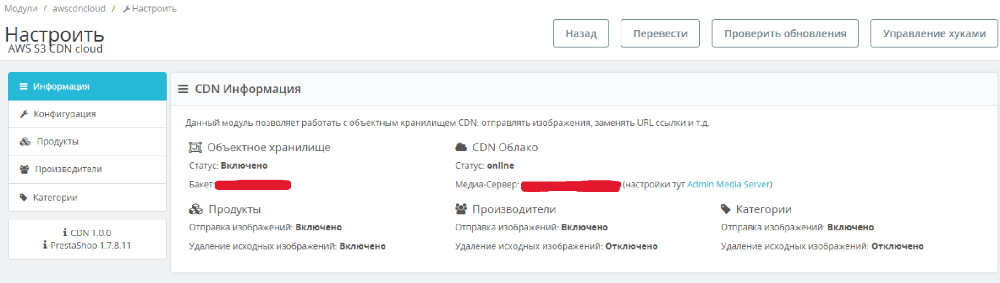
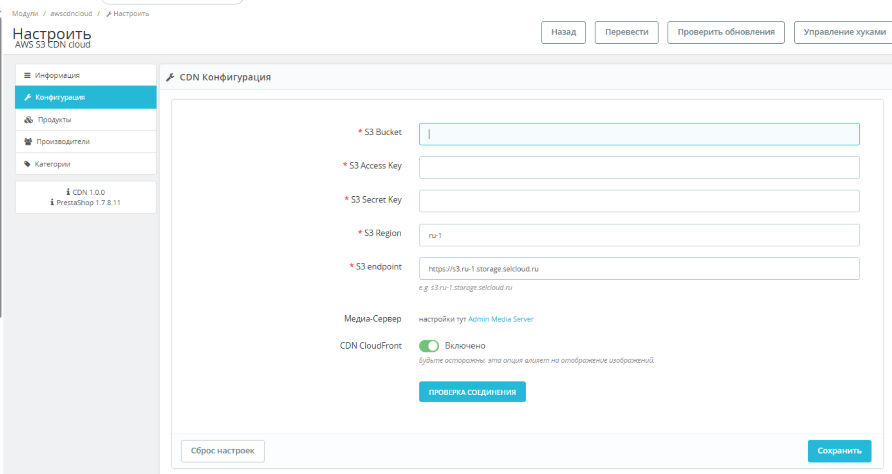
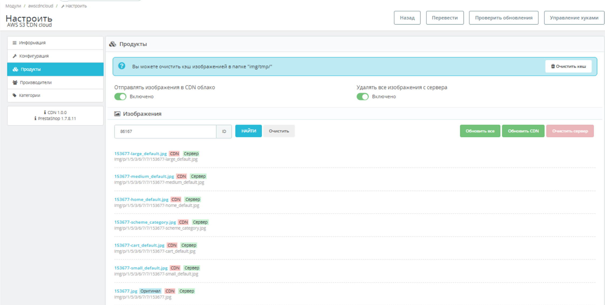

# AWS-CDN-CLOUD

CDN cloud for prestashop v1.7.8.
Sends images of products, brands, categories and basic images to the Selectel object storage.
Expands the capabilities of the basic functionality of PrestaShop for working with the CDN.





## Requirements

- Php 7.1 +
- Prestashop v1.7.0 + 
- AWS library
- Composer

## Installation

1. Clone the repository:
```bash
git clone https://github.com/Star-Street/AWS-CDN-CLOUD.git
cd AWS-CDN-CLOUD
```
2. Pack into .zip archive
3. Install module in the Prestashop Admin Panel
4. Configure the module
5. Set Media Storage in the Prestashop settings
6. Enable CDN

## Features

- [x] Send in Object Storage images products
- [x] Send in Object Storage images brands
- [x] Send in Object Storage images categories
- [X] Testing connection to object storage
- [x] Check status images and storage connection
- [x] Clear cache
- [x] Enable/disable connection options
- [x] Regeneration of original images
- [x] Logs
